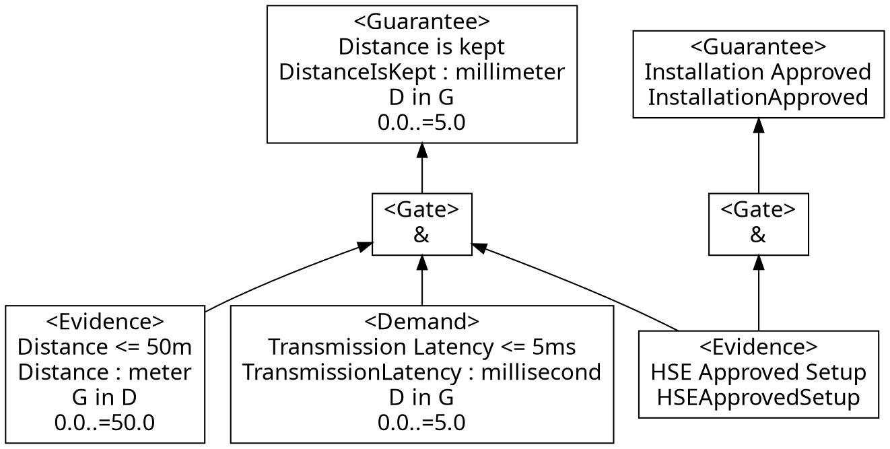
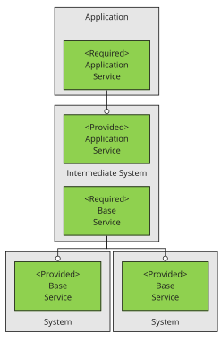

<!--
SPDX-FileCopyrightText: 2022 Andreas Schmidt <andreas.schmidt@iese.fraunhofer.de>

SPDX-License-Identifier: CC-BY-SA-4.0
-->

# ConSerts

The following shows an example ConSert:



A ConSert consists of:

* A set of *Guarantees* that can be provided at run-time, depending on the conditions.
* A set of *Runtime Evidence* which are gathered by the system itself.
* A set of *Demands* that the system has and which can be fulfilled by guarantees of other systems.
* Boolean success trees that combine runtime evidence and demands to find out whether a guarantee can be given or not. The tree supports the logic gates: *And* (&) and *Or* (||).
* Evidence as well as guarantees and demands can have a [dimension](./conserts/dimensions.md).

## Service Hierarchy

Not depicted here is that each guarantee belongs to one or more *Provided Services*.
Analogously, each demand belongs to one or more *Required Services*.
Each of these services have a type and only those with matching type can be combined.
Systems (grey) and their services (green) build up a hierarchy like depicted in this diagram:

<div style="text-align: center">
<a href="./diagrams/ServiceHierarchy.svg">

</a>
</div>

Note that there can be any number of layers and hence topologies of intermediate systems whose composition enables a high-level application service.

## Preliminary DDI Content

*Note: So far, ConSerts have not been completely integrated into the DDI framework. This is ongoing work in the [SESAME](https://cordis.europa.eu/project/id/101017258/de) project.*

The following YAML is the machine-readable representation of the ConSert depicted above.

```yaml
---
guarantees:
  - id: G_Distance
    description: Distance is kept
    dimension:
      Numeric:
        type: DistanceIsKept
        covered:
          - Inclusive:
              start: 0.0
              end: 5.0
        subset: Demand
        uom: millimeter
  - id: G_Approved
    description: Installation Approved
    dimension:
      Binary:
        type: InstallationApproved
evidence:
  - id: E_DistanceBound
    description: Distance <= 50m
    dimension:
      Numeric:
        type: Distance
        covered:
          - Inclusive:
              start: 0.0
              end: 50.0
        subset: Guarantee
        uom: meter
  - id: E_Approved
    description: HSE Approved Setup
    dimension:
      Binary:
        type: HSEApprovedSetup
demands:
  - id: Latency
    description: Transmission Latency <= 5ms
    dimension:
      Numeric:
        type: TransmissionLatency
        covered:
          - Inclusive:
              start: 0.0
              end: 5.0
        subset: Demand
        uom: millisecond
gates: []
tree_propagations:
  - from: E_DistanceBound
    to: G_Distance
  - from: E_Approved
    to: G_Distance
  - from: Latency
    to: G_Distance
  - from: E_Approved
    to: G_Approved
required_services:
  - id: LatencyService
    functional_service_type: Latency
    demands:
      - Latency
provided_services:
  - id: DistanceService
    functional_service_type: Distance
    guarantees:
      - G_Distance
```
