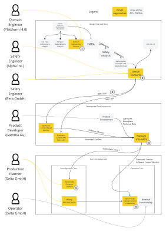
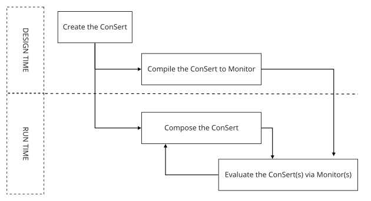

<!--
SPDX-FileCopyrightText: 2022 Andreas Schmidt <andreas.schmidt@iese.fraunhofer.de>

SPDX-License-Identifier: CC-BY-SA-4.0
-->

# Safety Engineering Lifecycle with ConSerts

Collaborative systems undergo the process from envisioning the system at design time, developing it, down to the operation.
These three phases in the product and service lifecycle are outlined in the following diagram.
We put a particular focus on the safety engineering of the system.
On the left, different <i class="fa fa-fw fa-user"></i> roles are depicted.

According to established safety standards (such as the ISO61508), only the grey boxes are present:
The safety analysis is executed as mandated by relevant standards for the domain.
First, the system is defined in terms of use case and product requirements.
Afterwards, a preliminary hazard and risk analysis (HARA) is executed, which helps to find *safety goals*.
The assurance of these safety goals is developed in an *assurance case*, using [*goal structuring notation*](https://www.goalstructuringnotation.info/).
This analysis informs product development and eventually, the operating time is impacted either through technical or organizational measures.

With *Conditional Safety Certificates* (ConSerts), this approach is altered:

* In addition to the traditional components of the system definition, a *Domain Engineering Process* is executed (1), defining the important terms and concepts of the domain in a type system. We envision this to be done by standardization organizations or comparable institutions. Existing efforts where this can be added are the [IEC 61360 Common Data Dictionary](https://cdd.iec.ch/).

* At the bottom of the V-process, we *Derive ConSerts* (2) which are model-based arguments that our system is safe, given the conditions stated in terms of the type system are satisfied. This derivation is done on the basis of the assurance case, which directly shows properties to be assured at runtime and/or collaborating partners to be present. [Verification and Validation](./vnv.md) activities are executed as well.

* The *ConSert* is then exported (3) as a [*Digital Dependability Identity*](./ddi.md)&nbsp;(DDI) compliant with the *Open Dependability Exchange*&nbsp;(ODE) format to make it usable further down the process.

* During development time, the ConSert is integrated into the existing process to create a product. Here, we show an example from the Industry 4.0 domain. The ConSert is used to generate a [ConSert-Monitor](./times/evaluation.md) (used at evaluation time) and a [ConSert Submodel](./times/composition.md) (used at composition time). Both are packaged into Asset Administration Shells (AAS) that can be exchanged with the AASX format (4).

* At runtime, e.g. in the factory, these artefacts are used to implement the safety concepts. When collaborating systems are grouped together and *reconfigured*, the ConSerts of all the individual systems are *composed* (5) to check if they are compatible and can, in principle, be operated safely. If this is the case, the ConSert monitors are deployed. These monitors collect the runtime evidence local to the system as well as guarantees from other systems (6). If their demands can be fulfilled and runtime evidence are given, the system might itself be able to give further guarantees to other systems.

In summary, the ConSert-based methodology allows us to move from a model-based safety engineering design process to model-based safety assurance at runtime in the factory.
This way, the link between high-level safety goals and low-level checks at runtime is maintained and can, in the spirit of *continuous safety assurance*, be updated when necessary.

## ConSerts Lifecycle

There are different times in the lifecycle of a ConSert.

A ConSert is created at *Design & Development Time* and used at *Runtime*.

At *runtime* we also have to distinguish between two times:

* [*Composition time*](./times/composition.md): When we check whether the ConSerts of constituent systems are *conceptually* compatible (e.g. for a reconfiguration of our system).

* [*Evaluation time*](./times/evaluation.md): When we check whether the ConSerts of constituted systems can *currently* cooperate.

So to summarize in one sentence: Typically, a ConSert spends most of its time in the *evaluation time*, occasionally it is in *composition time* and before it is put into use, it is in *design/development time*.

Graphically, this looks like this:

## Tools that help

At *design time*, [safeTbox](https://safetbox.de) supports the [development of ConSerts](./times/design.md) that result in exported model files.

At *development time* and *runtime*, [conserts-rs](./conserts-rs.md) is used for:

* *Composition*: With `conserts compose ...` multiple ConSerts model files can be checked for compatibility. Being a CLI utility, the output can be consumed via exit codes (allow composition or not) or verbosely, in order to report it to a user.

* *Evaluation*: With `conserts compile` a ConSert model file can be compiled to a Rust crate. This is used at *development time* when the constituent system is built. Hence, at runtime the structure cannot change, but the output changes depending on the inputs.
