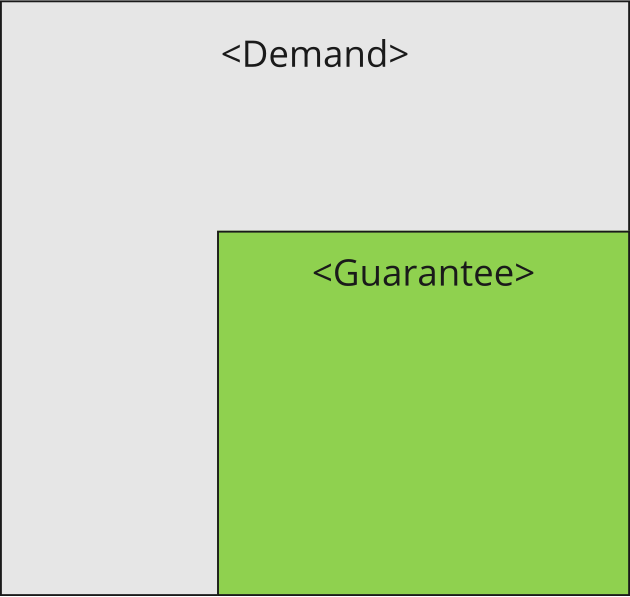
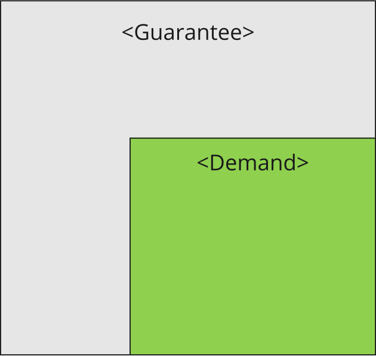
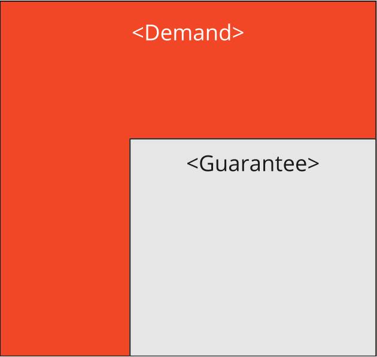

<!--
SPDX-FileCopyrightText: 2022 Andreas Schmidt <andreas.schmidt@iese.fraunhofer.de>

SPDX-License-Identifier: CC-BY-SA-4.0
-->

# Dimensions

In the context of collaborative cyber-physical systems, we are often faced with physical and digital quantities that must be measured, communicated, and acted upon.
Hence, correct handling of these quantities must be ensured to avoid errors.
In a ConSert, there are multiple elements that have a *Dimension*, in particular Guarantees, Demands, and Runtime Evidence.
The ConSert software (both [conserts-rs](../conserts-rs.md) and the generated crate) leverages the [uom](https://crates.io/crates/uom) crate to have type-safe zero-cost dimensional analysis.

## Relevance of Dimensions for ConSerts

Dimensions are used for two use cases:

1. At [composition time](../times/composition.md), we check if demands are fulfilled by guarantees, i.e. the related subset relation (see below) is fulfilled.
2. At [evaluation time](../times/evaluation.md), the monitor code generated by [conserts-rs](../conserts-rs.md) exposes this information to make it clear to the developer what information is expected:

```rust
// Definition
#[doc = "Approximation Speed of Detected Object X m/s"]
#[derive(Clone, Copy, Debug, PartialEq)]
pub enum ApproximationSpeedOfDetectedObject {
    Unknown,
    Known(uom::si::f64::Velocity),
}

// Usage
let velocity : f64 = velocity_sensor.sample();
let rtp: RuntimeProperties = ...;
rtp.approximation_speed_of_detected_object = 
    ApproximationSpeedOfDetectedObject::Known(
        Velocity::new::<meter_per_second>(velocity)
    );
```

## Details of Dimensions

A dimension can be either

1. binary (e.g., true, false), or
2. categorial (e.g., good/medium/bad) or
3. numerical (using a given number system).

In any case, a dimension has a unique type, derived from its name (e.g. `ApproximationSpeedOfDetectedObject`).

If we employ a numerical dimension, the dimension has a unit (e.g. "meter") or the unit is 1.

For demands and guarantees, a dimension has two properties:

* A `covered` set of values.
  * Intuitively speaking, this means which values are guaranteed (e.g. "I guarantee to be moving with at max. 2m/s" -> "0...2" is the covered set). The analogous applies for demands.
  * Formally, this covered set of values can be expressed by a set of disjoint inclusive ranges.
* A `subset` relationship of either:
  * `Demand`, where the covered set of demand values must be subset to the covered set of guarantee values.
  * `Guarantee`, where it is the other way round.

Graphically the subset relations look like this:

| Subset Relationship | Matching                       | Unmatched                        | Guide Sentence  |
|---------------------|--------------------------------|----------------------------------|-----------------|
| \\(G \subseteq D\\) |  |  | Demand at most  |
| \\(D \subseteq G\\) |  |  | Demand at least |

## Dimensionless Elements

If an element does not have a specified dimension, a match is only made on the type of the element&nbsp;(e.g. a Guarantee `InstallationApproved` fulfills any demand `InstallationApproved`).
We could consider this as a binary, unit-less dimension, where true is covered and false is not.
