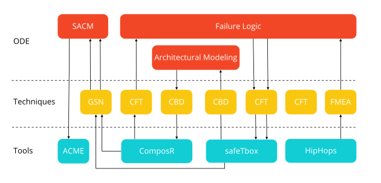

<!--
SPDX-FileCopyrightText: 2022 Andreas Schmidt <andreas.schmidt@iese.fraunhofer.de>

SPDX-License-Identifier: CC-BY-SA-4.0
-->

# Digital Dependability Identity

Within the [*Dependability Engineering Innovation for Cyber Physical Systems* (DEIS) project](https://www.deis-project.eu/), the concept of the *Digital Dependability Identity* (DDI) has been developed.

DDIs are formalized using the [*Open Dependability Exchange* (ODE) metamodel](https://deis-project.eu/fileadmin/user_upload/DEIS_D3.1_Specification_of_the_ODE_metamodel_and_documentation_of_the_fundamental_concept_of_DDI_PU.pdf), specified in EMF’s Ecore metamodel (an XML Metadata Interchange (XMI) specialization) and exported to well-established formats (e.g. XML).
The major idea is to create tool-interoperability as depicted in this diagram:

The ODE layer incorporates information about the dependability of the system.
At the techniques layer, we find different ways to analyze the different dependability properties of the system.
Finally, the tools layer gives a collection of tools with different capabilities in terms of implemented techniques.
The arrows indicate how transformations and tool-interactions can be achieved using the DDI concept.

ConSerts fit into this picture as another technique, in parallel to CFT or FMEA.
So far, this has not yet been fully integrated.
