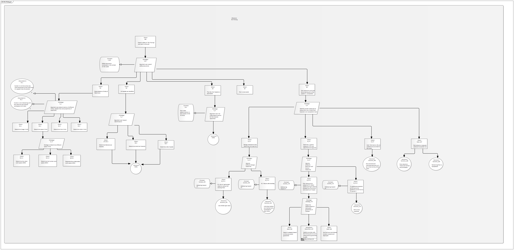
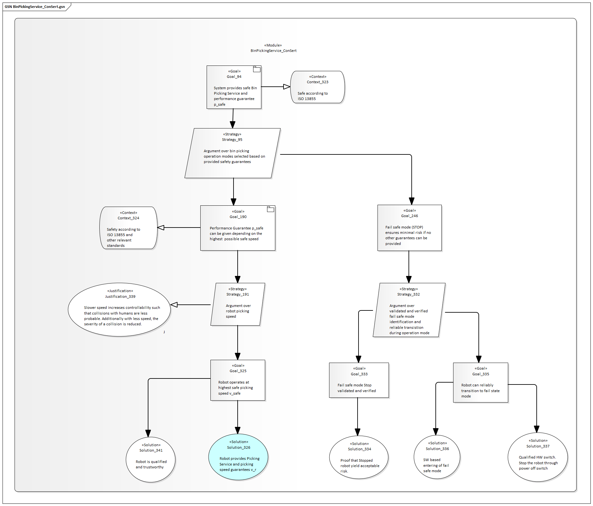
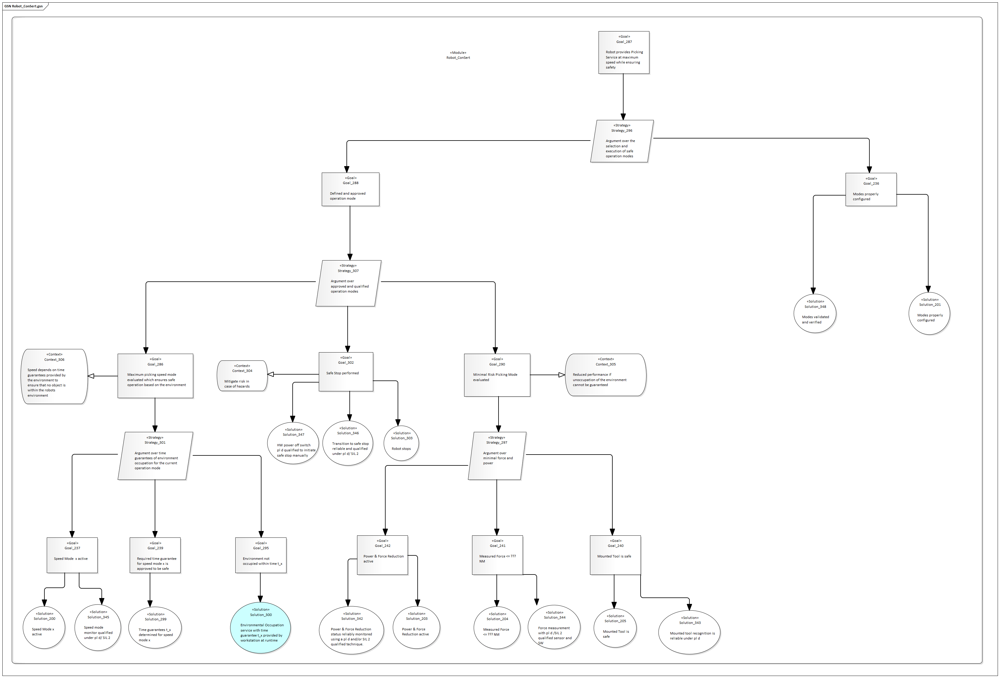
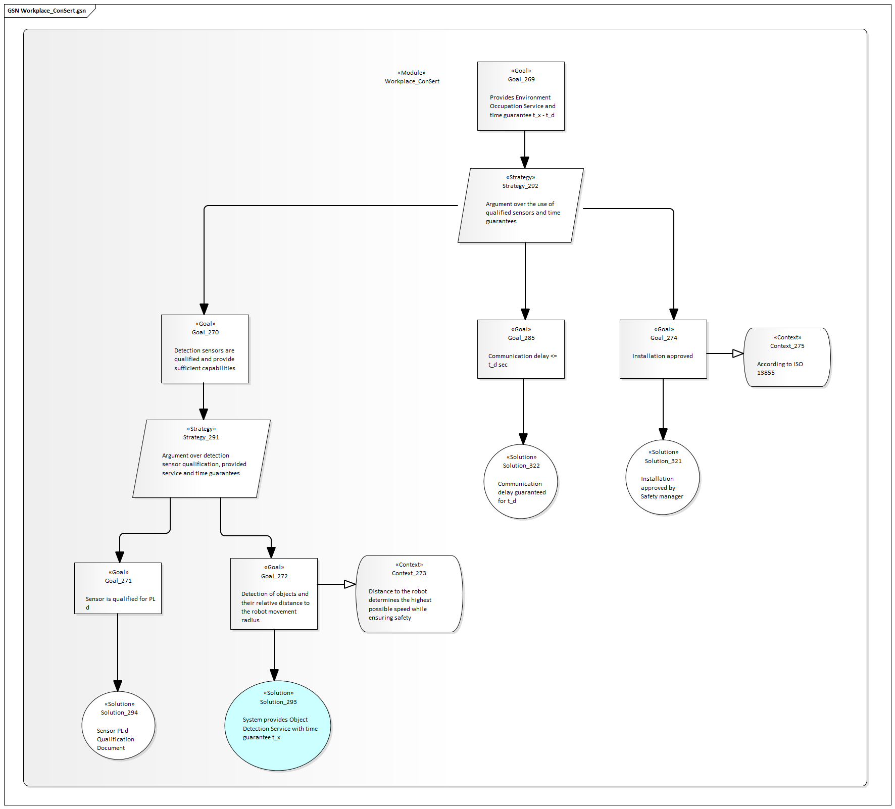
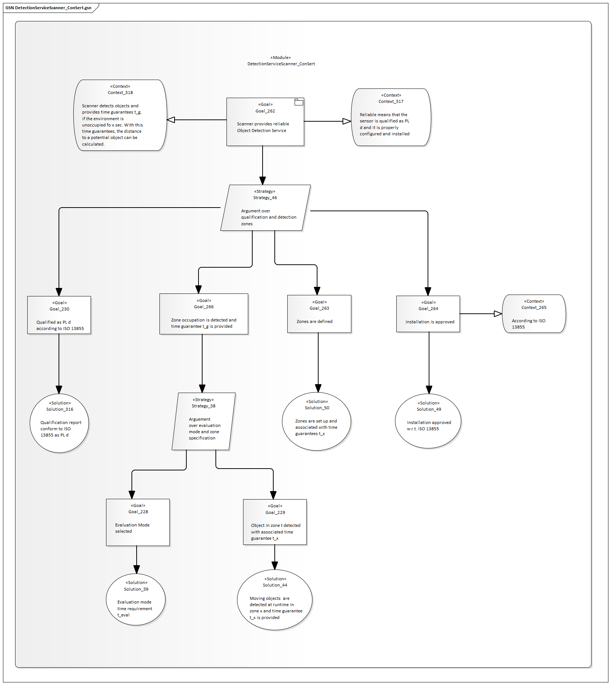
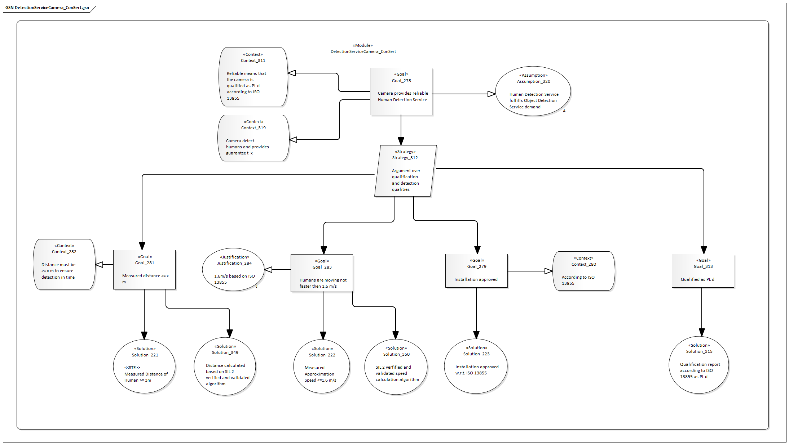

<!--
SPDX-FileCopyrightText: 2022 Andreas Schmidt <andreas.schmidt@iese.fraunhofer.de>

SPDX-License-Identifier: CC-BY-SA-4.0
-->

# Assurance Case

The following sections show the Assurance Cases developed for the overall use case and application, as well as system-level Assurance Cases that are translated into ConSerts in the next step.

## Human-Robot Collaboration Application

## Bin Picking Service

## Robot

## Workspace

## Scanner

## Camera

