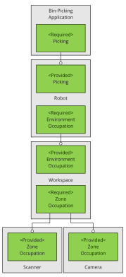
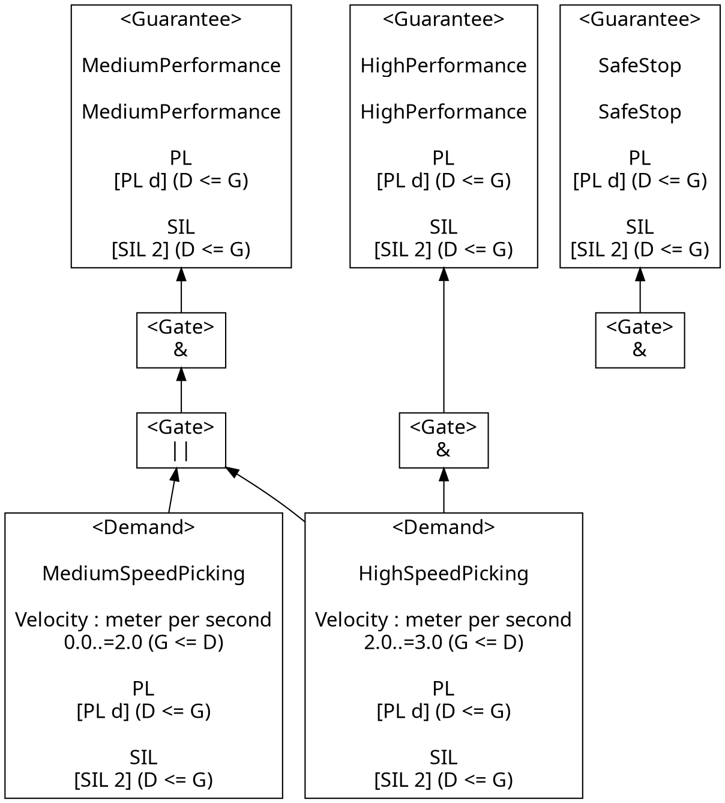
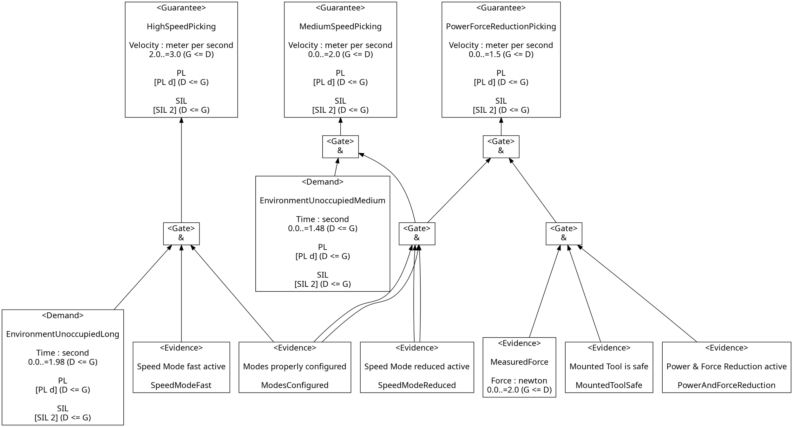
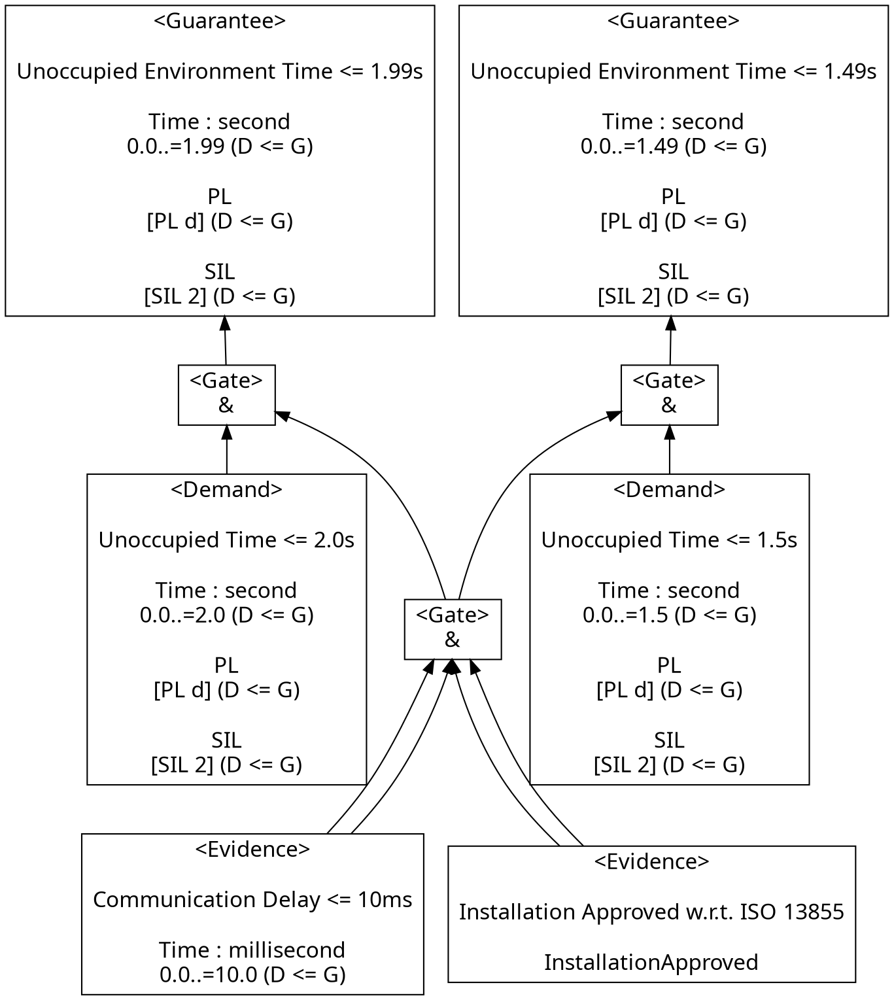
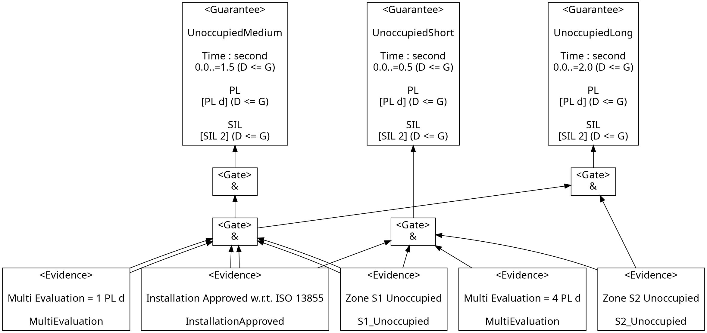

<!--
SPDX-FileCopyrightText: 2022 Andreas Schmidt <andreas.schmidt@iese.fraunhofer.de>

SPDX-License-Identifier: CC-BY-SA-4.0
-->

# ConSerts

At the system level, we have the following composition of services:

## Bin-Picking Application

At the application service level, we have the bin-picking application:

Depending on the provided performance of the robot, the high-level service can be provided with a different performance.
Concretely, a robot moving at full speed can process more items in the same time than if it runs at reduced speed.
In this use case, this is a 1:1 mapping, but more complex scenarios could have more intricate interactions between the performance of collaborating systems and the overall service performance.

## Robot

The high-level performance is primarily impacted by the robot arm:

The robot has demands in terms of an unoccupied environment.
The major quantity that must be guaranteed is the worst-case time window the environment can be guaranteed to be free.
The robot arm's current speed has a major impact on this requirement, as its stopping time is dependent on this.
Obviously, the run-time evidence "Modes properly configured" is required and checked manually by the health and safety engineer.

For each configured speed mode, we find the appropriate time \\(0 .. t\\) by considering the following measures and their effect on the worst-case stopping distance:

* *Robot Arm Speed*: deccelerating to 0 takes longer for higher speeds.
* *Robot Arm Elevation*: the arm might be closer to the edge of the workspace.
* *Robot Arm Load*: higher load means higher inertia and longer time to stop.
* *Electric Response Time*: is spent between the detection of a signal and the stop action.

Using the worst-case human speed, we can turn this into a time value \\(t\\).

Note that the ConSert could be more detailed if the robot has more sensing capabilities:

* If the loads of the arm are known, multiple values for its impact on the stopping time can be provided. Hence, lightly loaded arms can move faster.
* If the elevation is known, multiple values for its impact can be provided.

## Workspace

Providing guarantees about an unoccupied environment is done by the workspace:

In the workspace, we rely on a) detection services (e.g. sensors) as well as b) static measures (e.g. walls, fences) to guarantee a minimal time that is required for a human to go through the workspace into the robot's operation area.
We account for network communication delays (communicating the guarantees and demands between sensor and robot), reducing the guaranteed value appropriately, as well as other surcharges due to the setup of the workspace.
We further require a manual run-time evidence "Installation approved by HSE".

## Environment Detectors

Eventually, the environment detectors provide us with run-time information about the unoccupied state of the area around the robot:

### Scanner

Here, the provided time guarantee is impacted by various factors and in particular the operation mode of the sensor.
For the laser scanner, the following considerations are made (in accordance with ISO13855):

\\[t_{LS} = t_0 + \frac{TZ + Z_R + C}{1600mm/s} \\]

* Response Time of the Sensor: \\(t_0 = (t_s + t_i) \cdot n + t_p\\)
  * \\(t_s\\): Scan Cycle Time (often configurable, e.g. 30ms or 40ms).
  * \\(t_i\\): Interference Protection Time (0 to 3ms).
  * \\(n\\): Multi-evaluation (e.g. between 2 and 16).
  * \\(t_p\\): Signal processing time given by data sheet (e.g. 35ms).
* \\(TZ\\): Sensor Tolerance (static value given in handbook)
* \\(Z_R\\): Reflection surcharges (static values given in handbook)
* \\(C\\): Surcharges for undetected reaching modes, depending on the installation height: \\(C = 1200mm - (0.4 \cdot H_D)\\)

Using this \\(t_{LS}\\) and an equivalent \\(S_{LS}\\):

\\[S_{LS} = 1600 mm/s \cdot t_0 + TZ + Z_R + C\\]

Note that this is the minimal case, i.e. if the zone has a size of \\(S_{LS}\\) we can not guarantee more than 0 sec to other systems (all time budget is used for the scanner itself).
If we set the zone to a larger value \\(S\\), we get \\(S_{diff}\\) and respectively \\(t_{diff} = \frac{S_{diff}}{1600 mm/s}\\) as a time budget.
The matching guarantee (for this zone and scanner config) then guarantees \\(0\ \mathrm{..}\ t_{diff}\\).

Note that different safety zones (with increasing size) can guarantee larger values of \\(t\\).
Also the configuration options (e.g. multi-mode evaluation) have an impact.
