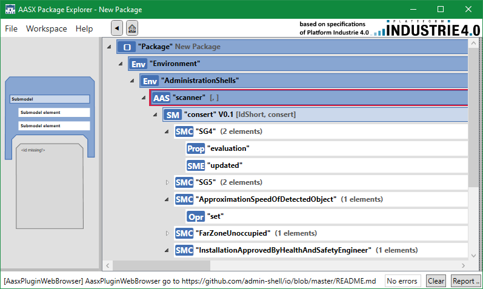

<!--
SPDX-FileCopyrightText: 2022 Andreas Schmidt <andreas.schmidt@iese.fraunhofer.de>

SPDX-License-Identifier: CC-BY-SA-4.0
-->

# Runtime ConSerts

Finally, using [conserts-rs](../conserts-rs.md), we have generated various runtime artifacts:

* A [*ConSerts Submodel*](#conserts-submodel)
* A [*ConSerts Runtime Monitor*](#conserts-monitor), supporting the intended target runtime:
  * Rust applications, without additional modifications
  * Bare-metal applications using `#![no_std]`
  * ROS nodes using `rosrust`
  * Other applications using the foreign function interface

## ConSerts Submodel

The following shows the automatically generated, [Industry-4.0 compatible](https://www.plattform-i40.de/IP/Redaktion/DE/Downloads/Publikation/Details_of_the_Asset_Administration_Shell_Part1_V3.html), submodel that describes the safety of our laser scanner system.



## ConSerts Monitor

```rust
// properties.rs
#[doc = "Approximation Speed of Detected Object X m/s"]
#[derive(Clone, Copy, Debug, PartialEq)]
pub enum ApproximationSpeedOfDetectedObject {
    Unknown,
    Known(uom::si::f64::Velocity),
}
```

```rust
// evidence.rs
impl RuntimeEvidence {
    pub fn from(runtime_properties: &RuntimeProperties) -> RuntimeEvidence {
        // ...
        let rt_e4 = {
            use crate::properties::ApproximationSpeedOfDetectedObject::*;
            match &runtime_properties.approximation_speed_of_detected_object {
                Unknown => false,
                Known(value) => {
                    (0f64..=1f64).contains(&value.get::<uom::si::velocity::meter_per_second>())
                }
            }
        };
        // ...
    }
}
```

```rust
// guarantees.rs
#[doc = "Far Environment Unoccupied by Humans"]
pub struct Sg5;
impl Sg5 {
    pub fn evaluate(runtime_evidence: &RuntimeEvidence) -> bool {
        {
            let c0 = {
                #[doc = "Far Zone Unoccupied."]
                let c0 = runtime_evidence.rt_e6;
                #[doc = "Approximation Speed of Detected Object <= 2m/s"]
                let c1 = runtime_evidence.rt_e7;
                c0 || c1
            };
            #[doc = "Installation Approved by Health and Safety Engineer"]
            let c1 = runtime_evidence.rt_e5;
            c0 && c1
        }
    }
}
```

## ROS Application Leveraging the Monitor

**Note: This is an exemplary deployment using the Robot Operating System (ROS) version 1. ROS1 cannot be used in safety-critical domains, however the approach for developing an application is going to be similar.**

The following shows how we can run a ROS monitor in a separate thread and manipulate the runtime properties in the main thread.
Due to `monitor.rtp` being an `Arc<AtomicCell<RuntimeProperties>>`, thread-safe access is possible.
Notice that `AtomicCell` uses *compare-and-swap*.
In our example, we ignore if this operations fails due to concurrent access.
A different solution would be to implement a bounded number of retry attempts to provide the information.

```rust
use consert_edcc2021::ros::RosMonitor;
use uom::si::f64::*;
use uom::si::frequency::hertz;
use uom::si::velocity::meter_per_second;

fn main() {
    let freq = Frequency::new::<hertz>(10);
    let mut monitor = RosMonitor::new();
    let mut rtp = monitor.rtp.clone();
    thread::spawn(move || monitor.run_standalone(freq));

    loop {
        // TODO: use actual sensor reading instead of constant
        let sample = Velocity::new::<meter_per_second>(5.0);

        let r_old = rtp.load();
        let mut r_new = r_old.clone();
        r_new.approximation_speed_of_detected_object = 
            ApproximationSpeedOfDetectedObject::Known(sample);
        rtp.compare_and_swap(r_old, r_new);
        thread::sleep(Duration::from_millis(100));
    }
}
```
