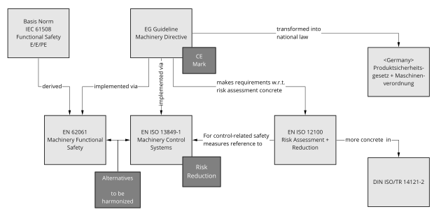

<!--
SPDX-FileCopyrightText: 2022 Andreas Schmidt <andreas.schmidt@iese.fraunhofer.de>

SPDX-License-Identifier: CC-BY-SA-4.0
-->

# Safety Analysis

**Note: This is an exemplary document. The risk assessment is considering a real demonstrator system, but should not be considered complete and/or correct.**

In order to assure the safety of the bin-picking use case, we execute a Safety Analysis, including *Hazard And Risk Analysis* (HARA), *Safety Concept Derivation*, and *Verification*.

First, we explore the regulatory landscape for the domain:

In the following we execute the HARA according to ISO12100. Here are some abbreviations:

* RI: Risk Index (1: Before Safety Measure, 2: After Safety Measure), computed according to risk graph in ISO TR 14121
* PL: Performance Level (concept from EN/ISO 13849-1 for technical measures)
* SIL: Safety Integrity Level (concept from IEC/EN 62061)
* C: Constructive Measure (inherently safe construction)
* T: Technical Measure
* CT: Control-Technical Measure
* U: User Information

## Mechanical Hazards & Countermeasures

| Hazard                                             | Consequence                  | Location / Lifecycle                   | RI (1) | Risk Reduction Measures                                                                    | PL Required | PL Achieved | Residual Risk                                                          | RI (2) |
|----------------------------------------------------|------------------------------|----------------------------------------|--------|------------------------------------------------------------------------------------------|-------------|-------------|------------------------------------------------------------------------|--------|
| Collision of Person w/ Robot Arm                   | Bruise, Fracture, Laceration | Commission, Operation                  | 4      | C: Lightweight Robot  CT: Stepwise Speed Scaling                                     | PL d        | PL d        | Fast Approach of Robot or malicious circumention can lead to collision | 1      |
| Pinch of body parts in between robot and obstacles | Bruise                       | Commission, Operation                  | 4      | CT: Four vertical safety layers constrain robot movement U: Correct installation     | PL d        | PL d        | Inadequate deployment makes control-technical measure ineffective      | 1      |
| Pinch of hand/arm between effector and table       | Bruise                       | Commission, Operation                  | 2      | CT: Force of effector limited to 140N. Max. value for hands/fingers acc. to ISO/TS 15066 | PL d        | PL d        | -                                                                      | -      |
| Overthrowing tables                                | Bruise                       | Commission, Operation, Setup, Teardown | 1      | C: Connect tables with eath other to ensure safe stand                                   | -           | -           | -                                                                      | -      |
| Pinch of fingers/hand due to grip of effector      | Bruise                       | Commission, Operation                  | 2      | CT: Grip force limit to 100N                                                             | PL d        | PL d        | Low force bruise                                                       | 1      |
| Fall down of work material due to ineffectiv grip  | Bruise                       | Commission, Operation                  | 2      | U: only use work material that is light enough to not cause injuries                     | -           | -           | -                                                                      | -      |

Here, we describe the safety measures in more detail:

* **Stepwise Speed Scaling:**
  * Humans near the robot are detected via laser scanner.
  * The speed of the robot is, at any time, scaled according to the current minimal distance between the human and the robot. Scaling is done in accordance with ISO/TS 15066, Sec. 5.5.4.
  * If a minimal distance is no longer mainted, the robot executes a safe stop. The minimal distance is derived from ISO 13855, Sec. 6.3.
* **Correct Installation:**
  * No obstacles should reach into the workspace of the robot.
  * Minimal distances between safety layers and surrounding obstacles must be ensured, according to ISO 13854.
* **Force Limitation:**
  * In this operation mode, it is required that for all possible collision scenarios, the resulting collision force and collision pressure are below certain body-part specific limits which are specified by ISO/TS 15066.
  * Possible collision scenarios and affected body parts are determined in a risk assessment procedure before commissioning.
  * Collision force limitation can be achieved by constructive measures (e.g. reduced robot mass, compliant joints), software measures (speed limitation, collision detection), or combinations of both.
  * Compliance with the force limitation requirements can be validated through a calculation model or measurements.

## Electrical Hazards & Countermeasures

| Hazard                                             | Consequence                  | Location / Lifecycle                   | RI (1) | Risk Reduction Measures                                                                                                                                                                         | PL/SIL | Residual Risk                                         | RI (2) |
|----------------------------------------------------|------------------------------|----------------------------------------|--------|-----------------------------------------------------------------------------------------------------------------------------------------------------------------------------------------------|--------|-------------------------------------------------------|--------|
| Touching parts with present voltage                | Electric Shock               | Commission, Operation, Setup, Teardown | 5      | C: Avoid contact of parts with present voltage T: Robot Control Device U: Only briefed staff can open cabinet U: Warning on harmful voltage U: Visual inspection of isolation | -      | Isolation could be damaged or warnings can be ignored | 2      |

Here, we describe the safety measures in more detail:

* **Avoid Contact of Parts with Present Voltage**:
  * Robot and Robot Control Device: only use original components of vendor, no eletric modifications
  * Laserscanner, Scanner Control Device: use low voltage (<= 24V), guard from touching through locked switch cabinet.
  * Power Supply Gripper: use low voltage (<= 24V)
  * Power Supply, Power Adapter: guard from touching through locked switch cabinet.

## Other Hazards & Countermeasures

| Hazard                                                              | Consequence                  | Location / Lifecycle  | RI (1) | Risk Reduction Measures                                                                                               | PL/SIL | Residual Risk                                                         | RI (2) |
|-----------------------------------------------------------------------|------------------------------|-----------------------|--------|---------------------------------------------------------------------------------------------------------------------|--------|-----------------------------------------------------------------------|--------|
| Bystanders could unintentionally / maliciously interfere with control | Various injuries             | Operation             | 5      | T: Areas not covered by scanner must be made inaccessible by other means U: Operators have to oversee operation | -      | Unintentional / malicious activation of control                       | 2      |
| Emergency stop is not reachable in critical situation                 | Various injuires             | Commission, Operation | 3      | U: During operations, emergency stop button must be within operator's reach                                         | -      | Emergency stop button cannot be reached in time (e.g. slow reaction). | 1      |
