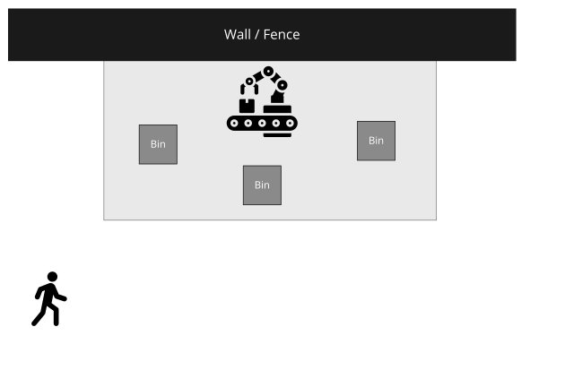

<!--
SPDX-FileCopyrightText: 2022 Andreas Schmidt <andreas.schmidt@iese.fraunhofer.de>

SPDX-License-Identifier: CC-BY-SA-4.0
-->

# System Description

We use a robotic bin-picking scenario, where a human collaborates with the robot by providing or collecting boxes with material on the workbench.
The robot is placed on the workbench that is also posing a limit on its working area.
The major threat in this scenario is that the human might get injured, which is what we are going to avoid with the approaches presented in the following.

The diagram above depicts this:

* The grey bin boxes contain material that is processed by the robot.
* The light grey area is the workspace of the robot.
* Towards the north, the workspace is limited by a wall or fence.

Note that this scenario is intentionally generic, as the safety approaches developed are also generic.
Hence, specific details such as the number of bins, the exact process steps executed by robot and human, are irrelevant.
