<!--
SPDX-FileCopyrightText: 2022 Andreas Schmidt <andreas.schmidt@iese.fraunhofer.de>

SPDX-License-Identifier: CC-BY-SA-4.0
-->

# Design & Development Time

The first phase in the lifecycle of a ConSert is the design and development time.
At this stage, safety engineers consider the planned system, its requirements, as well as impacts of these on safety.

ConSerts are a runtime means to implement specific parts of an assurance case (AC) &mdash; those that are affected by dynamic changes in the system and environment.
In model-based safety engineering, an AC contains a set of evidence (in AC terms: `Solution`s) at the leaf level, which proves that the argument can be given.
The approach of an AC is thereby similar to a success tree, where a top-level `Goal` is successfully fulfilled if sufficient leaf-level successes are there.
Here is an examplary, incomplete AC showing the different elements of it:

```dot process
digraph ac { 
    rankdir = TB;
    node [fontsize=16 shape=box fontname="Verdana"] 

    { rank = same;
    TLG[label="<Goal>\nThe system performs the\n nominal function safely"];
    Context[label="<Context>\nFoobar" style="rounded"];
    }
    Strategy[label="<Strategy>\nArgument over\nSteps in ISO47110" shape=parallelogram];
    G1[label="<Goal>\nThe installation\n is approved"];
    G2[label="<Goal>\nMeasured\nTemperature <= 99°C"];
    S1[label="<Solution>\nHSE checks installation" shape=ellipse];
    S2[label="<Solution>\nMeasure Temperature" shape=ellipse];
    TLG -> Strategy;
    TLG -> Context [arrowhead = "empty"];
    Strategy -> G1;
    Strategy -> G2;
    G1 -> S1;
    G2 -> S2;
}
```

## Assurance Case Development

Starting from a hazard- and risk analysis for a given nominal function, assurance cases are built up.
Note that there will not be a single assurance case, but a set of these &mdash; one per collaborating system.

The top-level assurance case has a top-level goal of "safe nominal function".
From this, an argumentation strategy is devised.
At some location, the argumentation strategy will encounter a solution of the form "if another system provides a service with the following properties".
These are the "intended breaking points" in between the collaborative systems.
Hence, the current assurance case ends at this location and another assurance case is built up for the "other system".

### Top-Level Application

### Lower Level System

## Assurance Case to ConSert

Based on the set of Assurance Cases we developed before, we can derive the ConSerts as follows:

* For each assurance case, we consider the top-level goals as a `ProvidedService` (with `Guarantee`) and leaf-level solutions that start with "if another system" as ConSert `RequiredService` (with `Demand`s). In this step, the semi-formal description can be formalized using [dimensions](../conserts/dimensions.md).
* Other leaf-level solutions can be turned into `RuntimeEvidence`, if they can only be given at runtime. Again, dimensions are used as appropriate. This runtime evidence can be sensor measurements (to be checked automatically) or manual checks or assumptions about the environment (e.g. the workspace is built in accordance with a certain norm).
* Eventually, the AC is analyzed and its logic (e.g. "argument over all ..." / "argument over at least one ...") are then translated into `Gate`s of the ConSert trees (e.g. And / Or). In this process, each guarantee gets its own ConSert tree that specifies which evidence is required for it to become valid.

Note that it can well be that an argument might be turned into multiple instances in the ConSert, e.g. because properties of demands have a direct relationship to their guarantees.
In the [worked example](../example.md), the assurance case captures how multiple robot speed guarantees and matching demands can be generated that follow the same argumentation pattern (only being different in the accepted value ranges they provide/require).
