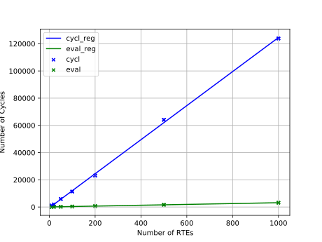

<!--
SPDX-FileCopyrightText: 2022 Andreas Schmidt <andreas.schmidt@iese.fraunhofer.de>

SPDX-License-Identifier: CC-BY-SA-4.0
-->

# Evaluation Time

As soon as we have composed a set of systems successfully using their ConSerts, they also collaborate in exchanging live information about their safety.
Each system is equipped with a ConSert-Runtime monitor (generated via [conserts-rs](../conserts-rs.md)), whose task is to:

* collect runtime evidence, both locally from the system (`RuntimeEvidence`) as well as receive it from other systems (`Guarantee`s of other the system, fulfilling the local `Demand`).
* keep a statistical filter with a certain window on the runtime evidence and use majority voted evidence to compute which `Guarantee`s this system can give.
* send out which guarantees can be given at this point in time.

## Analysis Pipeline

```rust
// collect runtime properties
let runtime_properties = RuntimeProperties {
    ...
}; // boolean and numerical properties

// update runtime_properties, often concurrently
monitor.add_sample(runtime_properties);

let runtime_evidence = monitor.get_sample(); // boolean evaluations, majority-filtered

// evaluate safety guarantees
let guarantee1 = Guarantee1::evaluate(&runtime_evidence);
```

## Performance Benchmark

As this step is executed all the time during operation, safety inference is the most performance-critical task and it must be ensured that it does not impede the nominal function of the system.
As we often target embedded, resource-constrained systems, both computation time and code size are imporant metrics.

The following shows how the size (in terms of number of runtime evidence) has an impact on both quantities of the generated ConSert Runtime monitor.

### Inference Time



Here, two times have been measured (and linear regression was applied to plot the lines).
The following snippet shows where the timestamps have been taken:

```rust
#[task(resources = [safe, monitor, rtp])]
fn evaluate_safety(cx: evaluate_safety::Context) {
    let start = Instant::now();
    let resources = cx.resources;
    // Move current sample to monitor
    resources.monitor.add_sample(*resources.rtp);
    *resources.rtp = RuntimeProperties::unknown();

    // Evaluate safety
    let rte = resources.monitor.get_sample();
    let cycle_time = start.elapsed().as_cycles();
    *resources.safe = guarantees::Guarantee1::evaluate(&rte);
    let eval_time = start.elapsed().as_cycles();
    // 64MHz -> 1 cycle = 16 ns = 0.016 us
    defmt::info!(
        "CYCL {:?} EVAL {:?} cycles",
        cycle_time,
        eval_time - cycle_time
    );
}
```

### Binary Size


### Evaluation Details

We employed a Nordic Semiconductor board (nRF52840), with a 64MHz ARM Cortex-M4 core with FPU, 1MB Flash, and 256 kB RAM.
While this board is not used in the safety-critical domain, the hardware resources are comparable with chips used in that domain with respect to processor speed and available memory.
All Rust code was compiled using the `--release` flag and no additional Cargo options.

The monitor has been generated with a statistical filter depth of 3 for all of the used runtime evidence.
The evidence has all been set to false and was aggregated via an OR gate, leading to worst-case performance as all logic operations must be executed.
